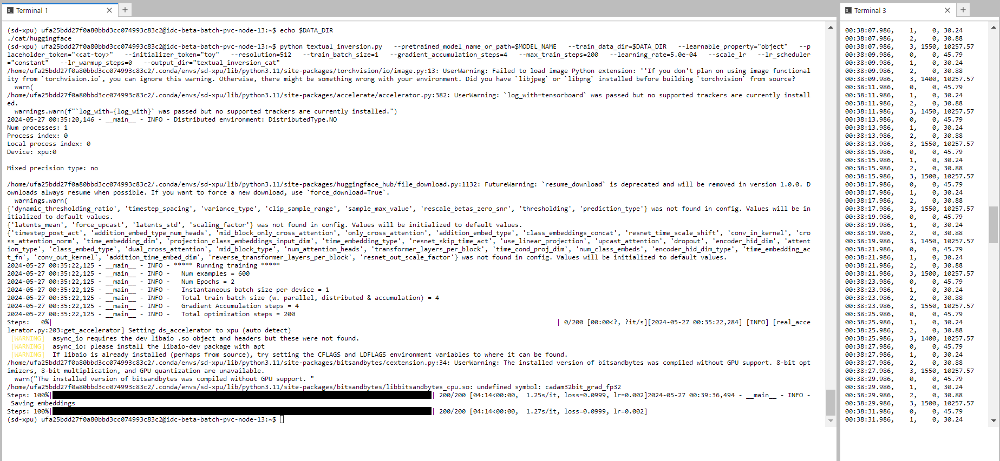

## Textual Inversion fine-tuning example

[Textual inversion](https://arxiv.org/abs/2208.01618) is a method to personalize text2image models like stable diffusion on your own images using just 3-5 examples.
The `textual_inversion.py` script shows how to implement the training procedure and adapt it for stable diffusion.

## Running locally with Intel Extension For PyTorch

### Activating oneAPI Environment

```bash
#Activate 2024.0 oneAPI environment
source /opt/intel/oneapi/2024.0/oneapi-vars.sh --force
source /opt/intel/oneapi/compiler/2024.0/env/vars.sh
source /opt/intel/oneapi/mkl/2024.0/env/vars.sh
```
### Creating Conda environment
```bash
conda create -n sd-xpu python=3.11 -y
conda activate sd-xpu
```

### Installing the dependencies

Before running the scripts, make sure to install the library's training dependencies:

**Important**

To make sure you can successfully run the latest versions of the example scripts, we highly recommend **installing from source** and keeping the install up to date as we update the example scripts frequently and install some example-specific requirements. To do this, execute the following steps in a new virtual environment(sd-xpu):
```bash
git clone https://github.com/huggingface/diffusers # If you've already cloned the git repository, make sure you are in /diffusers.
cd diffusers
pip install .
# Installing IPEX
python -m pip install torch==2.1.0a0 torchvision==0.16.0a0 torchaudio==2.1.0a0 intel-extension-for-pytorch==2.1.10+xpu --extra-index-url https://pytorch-extension.intel.com/release-whl/stable/xpu/us/
conda install -c conda-forge -y gperftools=2.10
pip install accelerate==0.23.0
pip install transformers==4.31.0
```


### Cat toy example

Now let's get our dataset. For this example we will use some cat images: https://huggingface.co/datasets/diffusers/cat_toy_example .

Let's first download it locally:

```py
from huggingface_hub import snapshot_download

local_dir = "./cat"
snapshot_download("diffusers/cat_toy_example", local_dir=local_dir, repo_type="dataset", ignore_patterns=".gitattributes")
```

This will be our training data.
Now we can launch the training using:

**___Note: Change the `resolution` to 768 if you are using the [stable-diffusion-2](https://huggingface.co/stabilityai/stable-diffusion-2) 768x768 model.___**

**___Note: Please follow the [README_sdxl.md](./README_sdxl.md) if you are using the [stable-diffusion-xl](https://huggingface.co/stabilityai/stable-diffusion-xl-base-1.0).___**

```bash
export MODEL_NAME="runwayml/stable-diffusion-v1-5"
export DATA_DIR="./cat"

python textual_inversion.py \ 
  --pretrained_model_name_or_path=$MODEL_NAME \
  --train_data_dir=$DATA_DIR \
  --learnable_property="object" \
  --placeholder_token="<cat-toy>" \
  --initializer_token="toy" \
  --resolution=512 \
  --train_batch_size=1 \
  --gradient_accumulation_steps=4 \
  --max_train_steps=200 \
  --learning_rate=5.0e-04 \
  --scale_lr \
  --lr_scheduler="constant" \
  --lr_warmup_steps=0 \
  --output_dir="textual_inversion_cat" \
  --mixed_precision bf16 \
  --save_as_full_pipeline
```



### Inference

Once you have trained a model using above command, the inference can be done simply using the `StableDiffusionPipeline`. Make sure to include the `placeholder_token` in your prompt.

```python
from diffusers import StableDiffusionPipeline
import torch
import intel_extension_for_pytorch as ipex
model_id = "path-to-your-trained-model"
pipe = StableDiffusionPipeline.from_pretrained(model_id,torch_dtype=torch.float16).to("xpu")

prompt = "A <cat-toy> backpack"

image = pipe(prompt, num_inference_steps=50, guidance_scale=7.5).images[0]

image.save("cat-backpack.png")
```


### Distributed Finetuning (TODO)

And initialize an [🤗 Accelerate](https://github.com/huggingface/accelerate/) environment with:

```bash
accelerate config
```